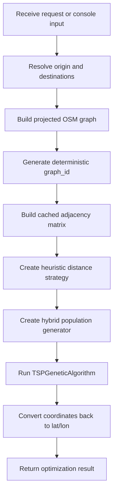
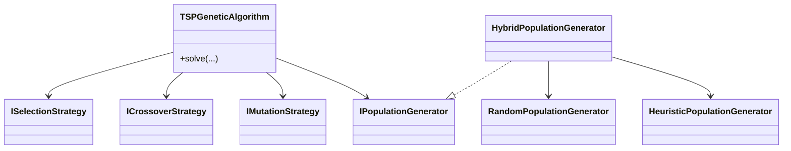

# API Best Route

`API Best Route` is a route-optimization service built around a multi-vehicle Genetic Algorithm over real street-network data from OpenStreetMap. The application resolves locations, builds a projected road graph, computes an adjacency matrix of route segments, and optimizes the visit order across one or more vehicles.

The current implementation combines:

- domain interfaces and models under `src/domain`;
- an orchestration layer in `src/application`;
- infrastructure implementations under `src/infrastructure`, including modular GA components and persistent caching adapters;
- delivery layers in `api/` and `console/`.

For detailed change history, see the files under `changelog/`.

## Highlights

- multi-vehicle route optimization with fleet-level aggregates;
- modular GA composition with injectable selection, crossover, mutation, and population-generation components;
- hybrid population seeding using heuristic and random generators;
- heuristic distance strategies based on projected Euclidean distance or adjacency-matrix metrics;
- persistent geocoding and adjacency-segment caching using SQLite;
- deterministic `graph_id` generation for cache-safe graph reuse;
- optional plotting support through `IPlotter`.

## Project Layout

```text
api_best_route/
├── api/
│   ├── dependencies.py
│   ├── main.py
│   └── schemas.py
├── changelog/
├── console/
│   └── main.py
├── src/
│   ├── application/
│   │   └── route_optimization_service.py
│   ├── domain/
│   │   ├── interfaces/
│   │   └── models/
│   └── infrastructure/
│       ├── caching/
│       ├── genetic_algorithm/
│       │   ├── crossover/
│       │   ├── distance/
│       │   ├── mutation/
│       │   ├── population/
│       │   └── selection/
│       ├── matplotlib_plotter.py
│       ├── osmnx_graph_generator.py
│       ├── route_calculator.py
│       └── tsp_genetic_algorithm.py
└── tests/
```

## Runtime Flow



## Installation

Install the project dependencies:

```bash
pip install -r requirements.txt
```

## Run the API

```bash
uvicorn api.main:app --reload
```

The interactive API documentation is available at:

- `http://127.0.0.1:8000/docs`

## Run the Console Example

```bash
python -m console.main
```

The console entry point demonstrates the same dependency graph used by the API, with an optional `MatplotlibPlotter` for visualization.

## API Summary

### `POST /optimize_route`

Main request parameters:

- `origin`: address string or `[lat, lon]` coordinates;
- `destinations`: list of `{location, priority}` items;
- `max_generation`;
- `max_processing_time`;
- `vehicle_count`;
- `population_size`;
- `weight_type`;
- `cost_type`.

Main response fields:

- `routes_by_vehicle`;
- `totals`;
- `best_fitness`;
- `population_size`;
- `generations_run`.

## Optimization Model

### Genetic Algorithm Composition

The optimizer itself is orchestration-only. Concrete behavior is injected at composition time.



### Available GA Operators

| Category | Implementation | Description |
|---|---|---|
| **Selection** | `RoulleteSelectionStrategy` | Fitness-proportionate selection via inverse-fitness weights |
| | `RankSelectionStrategy` | Rank-based weights; avoids dominance by a single high-fitness individual |
| | `StochasticUniversalSamplingSelectionStrategy` | Lower-variance roulette variant using two evenly-spaced pointers |
| | `TournamentSelectionStrategy` | Samples K competitors and elects the best; pressure controlled by `tournament_size` |
| **Crossover** | `OrderCrossoverStrategy` | Preserves relative order of a copied segment; fills remainder from the second parent |
| | `CycleCrossoverStrategy` | Preserves absolute positions via position-to-position cycle tracing |
| | `PartiallyMappedCrossoverStrategy` | Copies a middle segment and resolves conflicts via iterative mapping |
| | `EdgeRecombinationCrossoverStrategy` | Preserves adjacency edges; builds a unified edge map from both parents |
| **Mutation** | `InsertionMutationStrategy` | Removes one node and re-inserts it at a different position; supports cross-vehicle relocation |
| | `InversionMutationStrategy` | Reverses the sub-sequence between two indices; local diversity operator |
| | `TwoOptMutationStrategy` | Same reversal as inversion, motivated by 2-opt local search edge un-crossing |
| | `SwapAndRedistributeMutationStrategy` | Combines cross-vehicle redistribution and within-route position swap |
| **Population** | `RandomPopulationGenerator` | Produces fully shuffled random individuals |
| | `HeuristicPopulationGenerator` | Seeds with nearest-neighbour or convex-hull ordering guided by a distance strategy |
| | `HybridPopulationGenerator` | Composes random and heuristic generators at a configurable ratio |

### Heuristic Population Seeding

The hybrid seeding pipeline combines:

- `RandomPopulationGenerator` for exploration;
- `HeuristicPopulationGenerator` for stronger initial candidates;
- adjacency-aware distance strategies for heuristic ordering;
- mixed ordering mode with controlled diversification.

## Caching Overview

The project uses two separate caching layers:

1. **OSMnx HTTP cache** for OpenStreetMap downloads;
2. **application-level SQLite caches** for:
   - geocoding results;
   - adjacency segments.

### Graph Identity

Each generated graph is assigned a deterministic `graph_id` derived from:

- normalized bbox coordinates;
- the effective graph-selection spec:
  - canonicalized `custom_filter` when present;
  - otherwise `network_type`.

This `graph_id` is exposed through `GraphContext` and `RouteCalculator`, and is used to namespace adjacency cache entries safely.

### Segment Cache Key

Adjacency cache keys are composed from:

- `graph_id`
- `start_node_id`
- `end_node_id`
- `weight_type`
- `cost_type`

This prevents collisions across different graph downloads or route-metric configurations.

## Configuration

### OSMnx Cache Folder

`OSMnxGraphGenerator` resolves its cache folder with the following precedence:

1. constructor argument `cache_folder`;
2. environment variable `OSMNX_CACHE_FOLDER`;
3. default project-relative folder: `cache`.

### Persistent Cache Files

The default API and console wiring use:

- `cache/geocoding.db`
- `cache/adjacency_segments.db`

## Notes

- `weight_type="eta"` is the currently supported weight strategy in the route calculator.
- `cost_type="priority"` enables aggregated priority-weighted fitness.
- when `cost_type` is disabled, the fleet fitness falls back to `max_vehicle_eta`.
- empty vehicles are valid individuals and remain represented in the output.
- change details and release-by-release implementation notes belong in `changelog/`, not in this README.
