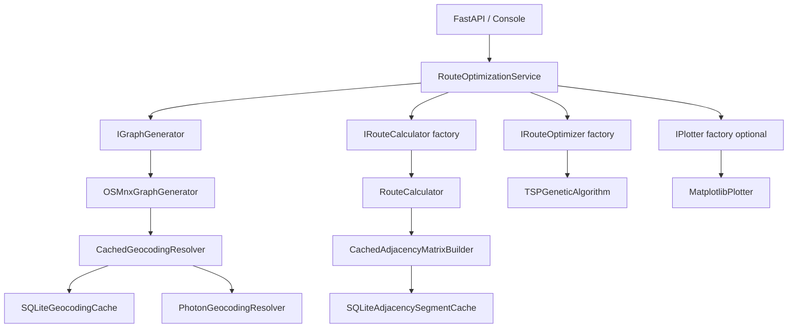
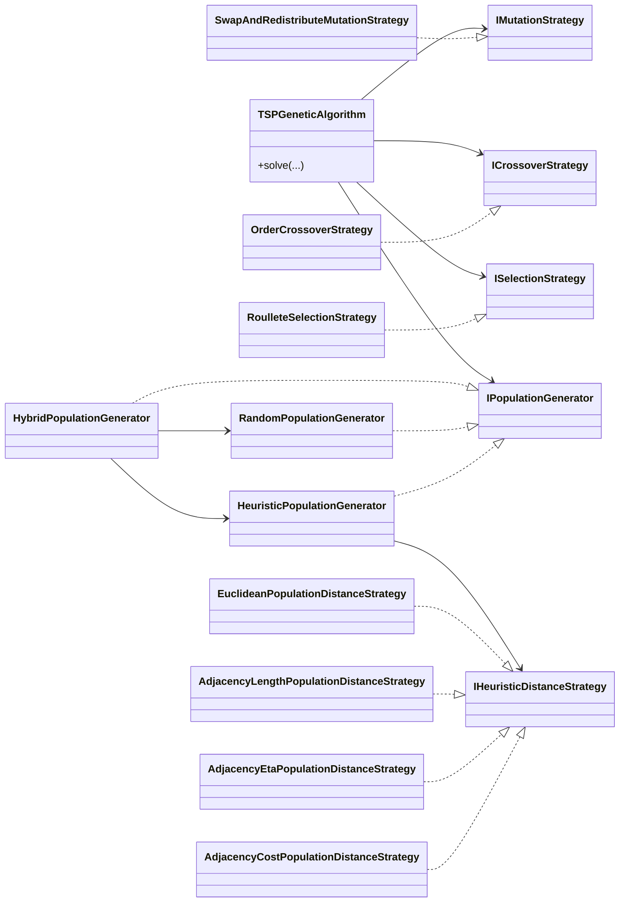
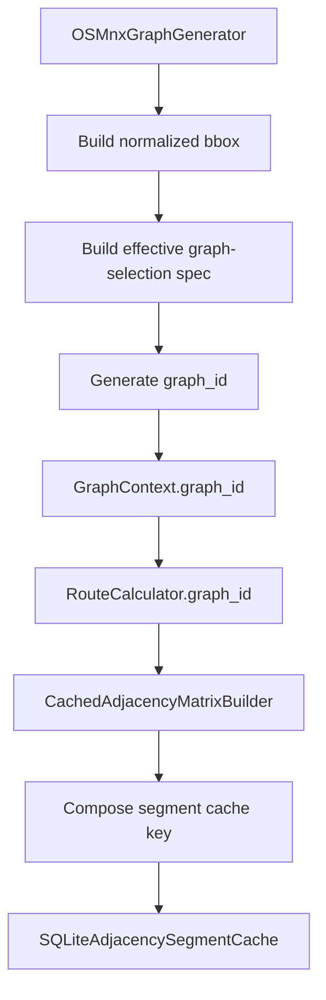

# Architecture Specification — API Best Route

## 1. Overview

`API Best Route` is a layered route-optimization system built around a multi-vehicle Genetic Algorithm over OpenStreetMap street-network data. The current architecture separates contracts, data models, orchestration, and infrastructure implementations, with dependency injection handled at the API and console entry points.

The architecture now includes:

- modular GA operators and population generators;
- adjacency-aware heuristic distance strategies;
- persistent geocoding and adjacency caching;
- deterministic graph identity for cache-safe reuse.

## 2. Architectural Principles

### 2.1 Layered separation

- **Domain** defines interfaces and models only.
- **Application** orchestrates the workflow.
- **Infrastructure** implements graph generation, route calculation, GA execution, plotting, and caching.
- **Entry points** wire dependencies and translate transport concerns.

### 2.2 Dependency inversion

High-level services depend on contracts from `src/domain/interfaces`. Concrete implementations live in `src/infrastructure` and are assembled only in composition roots such as `api/dependencies.py` and `console/main.py`.

### 2.3 Explicit contracts

Concrete infrastructure classes explicitly inherit the domain interfaces they implement. This keeps the architecture readable during code review and prevents accidental structural conformance from becoming a hidden coupling mechanism.

## 3. Current Directory Structure

```text
api_best_route/
├── api/
│   ├── dependencies.py
│   ├── main.py
│   └── schemas.py
├── changelog/
├── console/
│   └── main.py
├── src/
│   ├── application/
│   │   └── route_optimization_service.py
│   ├── domain/
│   │   ├── interfaces/
│   │   │   ├── adjacency_cache.py
│   │   │   ├── geocoding.py
│   │   │   ├── genetic_algorithm.py
│   │   │   ├── graph_generator.py
│   │   │   ├── heuristic_distance.py
│   │   │   ├── plotter.py
│   │   │   ├── route_calculator.py
│   │   │   └── route_optimizer.py
│   │   └── models/
│   │       ├── genetic_algorithm.py
│   │       ├── graph.py
│   │       ├── optimization.py
│   │       └── route.py
│   └── infrastructure/
│       ├── caching/
│       ├── genetic_algorithm/
│       │   ├── crossover/
│       │   ├── distance/
│       │   ├── mutation/
│       │   ├── population/
│       │   └── selection/
│       ├── matplotlib_plotter.py
│       ├── osmnx_graph_generator.py
│       ├── route_calculator.py
│       └── tsp_genetic_algorithm.py
└── tests/
```

## 4. System Composition



## 5. Domain Contracts and Models

### 5.1 Key interfaces

| Interface | Responsibility |
|---|---|
| `IGraphGenerator` | Resolve locations, build the projected graph, and expose coordinate conversion |
| `IRouteCalculator` | Compute route segments, resolve weight/cost callables, and expose `graph_id` |
| `IRouteOptimizer` | Solve the route optimization problem |
| `ISelectionStrategy` | Select parents for the GA |
| `ICrossoverStrategy` | Combine two individuals into a child |
| `IMutationStrategy` | Mutate an individual |
| `IPopulationGenerator` | Generate initial GA populations |
| `IHeuristicDistanceStrategy` | Resolve heuristic distances for seeding |
| `IGeocodingCache` | Persist forward and reverse geocoding results |
| `IAdjacencySegmentCache` | Persist adjacency segments keyed by graph identity and metric parameters |
| `IAdjacencyMatrixBuilder` | Assemble an adjacency matrix, optionally using persistent cache |
| `IPlotter` | Render optimization progress or results |

### 5.2 Key models

| Model | Purpose |
|---|---|
| `RouteNode` | Resolved location mapped to a graph node |
| `GraphContext` | Projected graph, resolved route nodes, CRS, and deterministic `graph_id` |
| `RouteSegment` | A computed segment between two route nodes |
| `RouteSegmentsInfo` | Aggregated metrics for an ordered sequence of segments |
| `VehicleRouteInfo` | One vehicle route plus totals |
| `FleetRouteInfo` | Fleet-wide aggregate over all vehicles |
| `OptimizationResult` | Result of one optimization run |
| `AdjacencyMatrixMap` | In-memory mapping from `(start_node_id, end_node_id)` to `RouteSegment` |

## 6. Genetic Algorithm Architecture



### 6.1 Heuristic seeding flow

The heuristic population generator is responsible for:

- clustering destinations with `KMeans`;
- ordering each cluster with nearest-neighbor or convex-hull-guided heuristics;
- applying controlled diversification in `mixed` mode;
- raising a clear error if the chosen heuristic metric is unavailable, rather than silently falling back.

## 7. Caching Architecture



### 7.1 Graph identity

`OSMnxGraphGenerator` creates a deterministic `graph_id` from:

- normalized bbox coordinates;
- the effective graph-selection spec:
  - canonicalized `custom_filter` when present;
  - otherwise `network_type`.

This identity is stored on the graph and exposed through `GraphContext` and `RouteCalculator`.

### 7.2 Cache keys

Adjacency segment cache keys are composed from:

- `graph_id`
- `start_node_id`
- `end_node_id`
- `weight_type`
- `cost_type`

This guarantees that different graph downloads or metric configurations do not collide in the cache.

### 7.3 Cache implementations

The `src/infrastructure/caching` package currently contains:

- `SQLiteGeocodingCache`
- `SQLiteAdjacencySegmentCache`
- `CachedGeocodingResolver`
- `PhotonGeocodingResolver`
- `DirectAdjacencyMatrixBuilder`
- `CachedAdjacencyMatrixBuilder`

SQLite connections are explicitly closed after each operation to avoid file-lock issues, especially on Windows.

## 8. Application Service

`RouteOptimizationService` is the single workflow orchestrator. It:

1. initializes the graph and route nodes;
2. creates a route calculator for the current graph;
3. optionally creates a plotter;
4. creates the optimizer through the injected factory;
5. runs optimization;
6. converts projected coordinates back to lat/lon for the result.

The service does not know how graph caching, adjacency caching, or GA operator composition are implemented.

## 9. Entry Points and Dependency Injection

### 9.1 API wiring

`api/dependencies.py` is the main composition root. It wires:

- cached geocoding;
- cached adjacency building;
- heuristic distance strategy selection;
- hybrid population generation;
- concrete GA strategies.

### 9.2 Console wiring

`console/main.py` mirrors the API composition while optionally injecting `MatplotlibPlotter`.

## 10. Technology Notes

| Library | Role |
|---|---|
| `OSMnx` | Graph download, projection, and nearest-node resolution |
| `NetworkX` | Shortest-path computation and graph model |
| `geopy` | Photon geocoding resolver |
| `Shapely` | Spatial centroid and convex-hull operations |
| `PyProj` | Coordinate transformation |
| `NumPy` | Selection weights and heuristic helpers |
| `scikit-learn` | `KMeans` clustering for heuristic seeding |
| `FastAPI` | HTTP entry point |
| `Pydantic` | API schemas |
| `Matplotlib` | Optional plotter implementation |

## 11. Responsibility Summary

| Component | Layer | Responsibility |
|---|---|---|
| `src/domain/interfaces/*` | Domain | Contracts for the application and infrastructure |
| `src/domain/models/*` | Domain | Data structures and typed aggregates |
| `RouteOptimizationService` | Application | End-to-end workflow orchestration |
| `OSMnxGraphGenerator` | Infrastructure | Graph generation, geocoding, `graph_id`, coordinate conversion |
| `RouteCalculator` | Infrastructure | Segment computation and graph-aware metrics |
| `src/infrastructure/genetic_algorithm/*` | Infrastructure | GA operators, population generation, heuristic distance strategies |
| `TSPGeneticAlgorithm` | Infrastructure | Evolution loop over injected collaborators |
| `src/infrastructure/caching/*` | Infrastructure | Persistent caching adapters and cache-aware builders |
| `api/*` | Entry point | HTTP transport and dependency composition |
| `console/main.py` | Entry point | Local execution and demonstration wiring |
