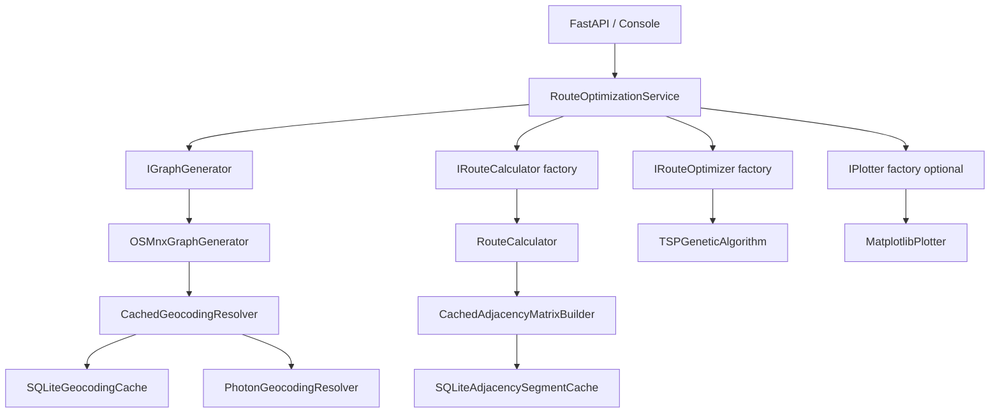
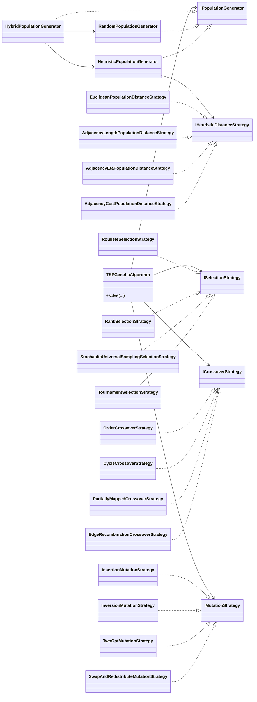
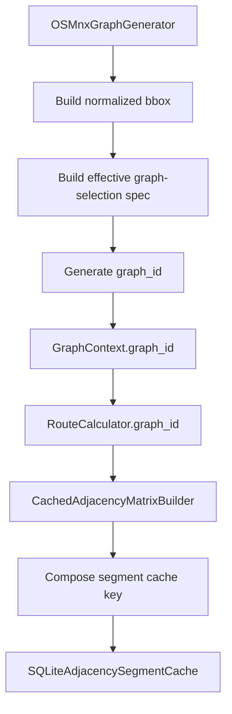
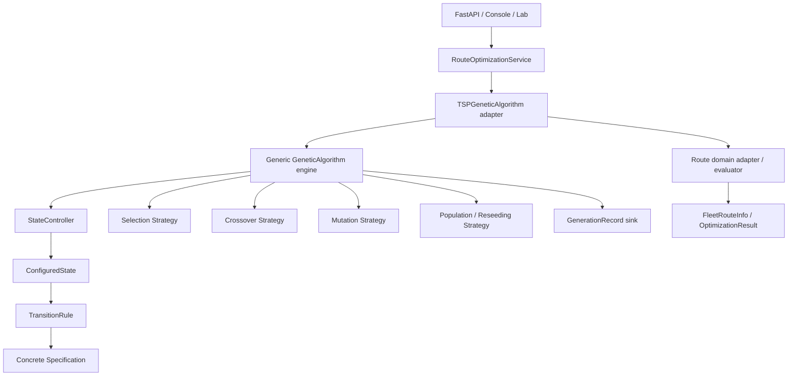

# Architecture Specification — API Best Route

## 1. Overview

`API Best Route` is a layered route-optimization system built around a multi-vehicle Genetic Algorithm over OpenStreetMap street-network data. The current architecture separates contracts, data models, orchestration, and infrastructure implementations, with dependency injection handled at the API and console entry points.

The architecture now includes:

- modular GA operators and population generators;
- adjacency-aware heuristic distance strategies;
- persistent geocoding and adjacency caching;
- deterministic graph identity for cache-safe reuse.

## 2. Architectural Principles

### 2.1 Layered separation

- **Domain** defines interfaces and models only.
- **Application** orchestrates the workflow.
- **Infrastructure** implements graph generation, route calculation, GA execution, plotting, and caching.
- **Entry points** wire dependencies and translate transport concerns.

### 2.2 Dependency inversion

High-level services depend on contracts from `src/domain/interfaces`. Concrete implementations live in `src/infrastructure` and are assembled only in composition roots such as `api/dependencies.py` and `console/main.py`.

### 2.3 Explicit contracts

Concrete infrastructure classes explicitly inherit the domain interfaces they implement. This keeps the architecture readable during code review and prevents accidental structural conformance from becoming a hidden coupling mechanism.

## 3. Current Directory Structure

```text
api_best_route/
├── api/
│   ├── dependencies.py
│   ├── main.py
│   └── schemas.py
├── changelog/
├── console/
│   └── main.py
├── src/
│   ├── application/
│   │   └── route_optimization_service.py
│   ├── domain/
│   │   ├── interfaces/
│   │   │   ├── adjacency_cache.py
│   │   │   ├── geocoding.py
│   │   │   ├── genetic_algorithm.py
│   │   │   ├── graph_generator.py
│   │   │   ├── heuristic_distance.py
│   │   │   ├── plotter.py
│   │   │   ├── route_calculator.py
│   │   │   └── route_optimizer.py
│   │   └── models/
│   │       ├── genetic_algorithm.py
│   │       ├── graph.py
│   │       ├── optimization.py
│   │       └── route.py
│   └── infrastructure/
│       ├── caching/
│       ├── genetic_algorithm/
│       │   ├── crossover/
│       │   ├── distance/
│       │   ├── mutation/
│       │   ├── population/
│       │   └── selection/
│       ├── matplotlib_plotter.py
│       ├── osmnx_graph_generator.py
│       ├── route_calculator.py
│       └── tsp_genetic_algorithm.py
└── tests/
```

## 4. System Composition



## 5. Domain Contracts and Models

### 5.1 Key interfaces

| Interface | Responsibility |
|---|---|
| `IGraphGenerator` | Resolve locations, build the projected graph, and expose coordinate conversion |
| `IRouteCalculator` | Compute route segments, resolve weight/cost callables, and expose `graph_id` |
| `IRouteOptimizer` | Solve the route optimization problem |
| `ISelectionStrategy` | Select parents for the GA |
| `ICrossoverStrategy` | Combine two individuals into a child |
| `IMutationStrategy` | Mutate an individual |
| `IPopulationGenerator` | Generate initial GA populations |
| `IHeuristicDistanceStrategy` | Resolve heuristic distances for seeding |
| `IGeocodingCache` | Persist forward and reverse geocoding results |
| `IAdjacencySegmentCache` | Persist adjacency segments keyed by graph identity and metric parameters |
| `IAdjacencyMatrixBuilder` | Assemble an adjacency matrix, optionally using persistent cache |
| `IPlotter` | Render optimization progress or results |

### 5.2 Key models

| Model | Purpose |
|---|---|
| `RouteNode` | Resolved location mapped to a graph node |
| `GraphContext` | Projected graph, resolved route nodes, CRS, and deterministic `graph_id` |
| `RouteSegment` | A computed segment between two route nodes |
| `RouteSegmentsInfo` | Aggregated metrics for an ordered sequence of segments |
| `VehicleRouteInfo` | One vehicle route plus totals |
| `FleetRouteInfo` | Fleet-wide aggregate over all vehicles |
| `OptimizationResult` | Result of one optimization run |
| `AdjacencyMatrixMap` | In-memory mapping from `(start_node_id, end_node_id)` to `RouteSegment` |

## 6. Genetic Algorithm Architecture



### 6.1 Heuristic seeding flow

The heuristic population generator is responsible for:

- clustering destinations with `KMeans`;
- ordering each cluster with nearest-neighbor or convex-hull-guided heuristics;
- applying controlled diversification in `mixed` mode;
- raising a clear error if the chosen heuristic metric is unavailable, rather than silently falling back.

## 7. Caching Architecture



### 7.1 Graph identity

`OSMnxGraphGenerator` creates a deterministic `graph_id` from:

- normalized bbox coordinates;
- the effective graph-selection spec:
  - canonicalized `custom_filter` when present;
  - otherwise `network_type`.

This identity is stored on the graph and exposed through `GraphContext` and `RouteCalculator`.

### 7.2 Cache keys

Adjacency segment cache keys are composed from:

- `graph_id`
- `start_node_id`
- `end_node_id`
- `weight_type`
- `cost_type`

This guarantees that different graph downloads or metric configurations do not collide in the cache.

### 7.3 Cache implementations

The `src/infrastructure/caching` package currently contains:

- `SQLiteGeocodingCache`
- `SQLiteAdjacencySegmentCache`
- `CachedGeocodingResolver`
- `PhotonGeocodingResolver`
- `DirectAdjacencyMatrixBuilder`
- `CachedAdjacencyMatrixBuilder`

SQLite connections are explicitly closed after each operation to avoid file-lock issues, especially on Windows.

## 8. Application Service

`RouteOptimizationService` is the single workflow orchestrator. It:

1. initializes the graph and route nodes;
2. creates a route calculator for the current graph;
3. optionally creates a plotter;
4. creates the optimizer through the injected factory;
5. runs optimization;
6. converts projected coordinates back to lat/lon for the result.

The service does not know how graph caching, adjacency caching, or GA operator composition are implemented.

## 9. Entry Points and Dependency Injection

### 9.1 API wiring

`api/dependencies.py` is the main composition root. It wires:

- cached geocoding;
- cached adjacency building;
- heuristic distance strategy selection;
- hybrid population generation;
- concrete GA strategies.

### 9.2 Console wiring

`console/main.py` mirrors the API composition while optionally injecting `MatplotlibPlotter`.

## 10. Technology Notes

| Library | Role |
|---|---|
| `OSMnx` | Graph download, projection, and nearest-node resolution |
| `NetworkX` | Shortest-path computation and graph model |
| `geopy` | Photon geocoding resolver |
| `Shapely` | Spatial centroid and convex-hull operations |
| `PyProj` | Coordinate transformation |
| `NumPy` | Selection weights and heuristic helpers |
| `scikit-learn` | `KMeans` clustering for heuristic seeding |
| `FastAPI` | HTTP entry point |
| `Pydantic` | API schemas |
| `Matplotlib` | Optional plotter implementation |

## 11. Responsibility Summary

| Component | Layer | Responsibility |
|---|---|---|
| `src/domain/interfaces/*` | Domain | Contracts for the application and infrastructure |
| `src/domain/models/*` | Domain | Data structures and typed aggregates |
| `RouteOptimizationService` | Application | End-to-end workflow orchestration |
| `OSMnxGraphGenerator` | Infrastructure | Graph generation, geocoding, `graph_id`, coordinate conversion |
| `RouteCalculator` | Infrastructure | Segment computation and graph-aware metrics |
| `src/infrastructure/genetic_algorithm/*` | Infrastructure | GA operators, population generation, heuristic distance strategies |
| `TSPGeneticAlgorithm` | Infrastructure | Evolution loop over injected collaborators |
| `src/infrastructure/caching/*` | Infrastructure | Persistent caching adapters and cache-aware builders |
| `api/*` | Entry point | HTTP transport and dependency composition |
| `console/main.py` | Entry point | Local execution and demonstration wiring |

## 12. Target Architecture — Generic Adaptive GA

The next architectural evolution of `API Best Route` is a refactor from a route-shaped GA implementation into a **problem-agnostic genetic algorithm core** with a route-specific adapter and configuration-driven adaptive behavior.

This target architecture preserves the route-optimization application boundary while removing route semantics from the GA execution engine itself.

### 12.1 Target responsibility split

The future responsibility split is:

- **Generic GA core**
    - population lifecycle orchestration;
    - generation loop execution;
    - ranking flow;
    - elitism;
    - parent selection;
    - crossover;
    - mutation;
    - optional reseeding/injection;
    - termination by time, generation budget, or future convergence rules;
    - state-controller consultation;
    - generation-record emission.

- **GA domain abstraction**
    - define the abstract solution model the GA depends on;
    - expose evaluated-solution semantics such as fitness and comparable metrics;
    - isolate problem-specific meaning from the engine.

- **Route adapter / facade**
    - accept route-specific inputs such as `route_nodes` and adjacency information;
    - evaluate route solutions using routing semantics;
    - assemble `FleetRouteInfo` and related route aggregates;
    - preserve the `IRouteOptimizer` contract used by the application service;
    - translate generic GA outputs back into route-domain results.

### 12.2 Why `TSPGeneticAlgorithm` remains as an adapter

The future generic engine does not eliminate the need for a route-specific adapter.

`IPopulationGenerator` alone is not sufficient to replace the current `TSPGeneticAlgorithm` role, because population generation only answers how candidate solutions are created or reseeded. It does not cover:

- route evaluation through the adjacency matrix;
- route-specific fitness translation;
- empty-route and origin-segment handling;
- fleet-route result assembly;
- route-optimizer integration through `IRouteOptimizer`.

For that reason, `TSPGeneticAlgorithm` should evolve into a **thin route adapter/facade** over the generic engine instead of remaining the owner of the GA loop.

### 12.3 Domain abstraction for GA-compatible solutions

The GA must stop depending directly on route-specific concepts such as `FleetRouteInfo`, `VehicleRoute`, or route-shaped `Individual` assumptions.

The target model is a domain abstraction where route concepts become one concrete specialization. A useful separation is:

- **raw solution abstraction**
    - manipulated by generation, mutation, crossover, cloning, and normalization;
- **evaluated solution abstraction**
    - exposes fitness and comparable metrics needed by ranking, records, logging, and transition rules.

This enables future changes in route structure, vehicle policy, or problem representation without forcing architectural changes in the GA core.

### 12.4 Adaptive state model

Adaptive behavior will be configured through a runtime state model rather than hardcoded phase classes in production.

The target components are:

- `GenerationContext`
    - runtime metrics for one generation, such as generation index, progress ratio, best fitness, stale generations, improvement ratio, and other convergence signals;
- `GenerationRecord`
    - one structured record describing what happened in a generation;
- `ConfiguredState`
    - one state definition containing the active operator bundle and ordered transition rules;
- `StateController`
    - resolves the active state during execution;
- `TransitionRule`
    - defines when the controller should activate a target state;
- concrete `Specification` classes
    - evaluate concrete runtime conditions against `GenerationContext`.

### 12.5 Rule semantics

The adaptive runtime semantics follow the conceptual model already validated in the notebook under `concepts/stateful_ga_phase_example.ipynb`.

- A `TransitionRule` evaluates its internal specifications with **AND** semantics.
- A state evaluates its ordered transition rules with **OR** semantics.
- The **first matching rule wins** and activates its target state.
- Specifications are **concrete classes** with constructor parameters; configuration selects which class to instantiate and which parameters to pass.

This keeps semantics in code and composition in configuration.

## 13. Phase 1 Boundary Decisions

The following decisions define the implementation boundary for the refactor.

1. The GA core must be problem agnostic and must not depend on route-domain models.
2. `TSPGeneticAlgorithm` remains as the route-optimizer-facing adapter/facade over the generic engine.
3. Production adaptive states are configuration-composed, not predefined domain-specific state classes.
4. Transition specifications are concrete classes instantiated from configuration parameters.
5. `TransitionRule` uses AND semantics across its specifications.
6. A state uses ordered OR semantics across its transition rules, where the first match wins.
7. The console lab and its configuration format may be redesigned around the new stateful composition model without backward compatibility.
8. The API keeps the current scalar parameters and gains adaptive GA configuration as an additional input path.

### 13.1 Planned composition view



### 13.2 Implementation consequence

Any change proposed in later phases should be rejected if it violates one of these boundaries:

- putting route semantics back into the generic engine;
- encoding transition semantics directly in configuration files instead of concrete specification classes;
- moving route-adapter responsibilities into entry-point factories or application services;
- coupling generation records directly to lab-only reporting concerns.
