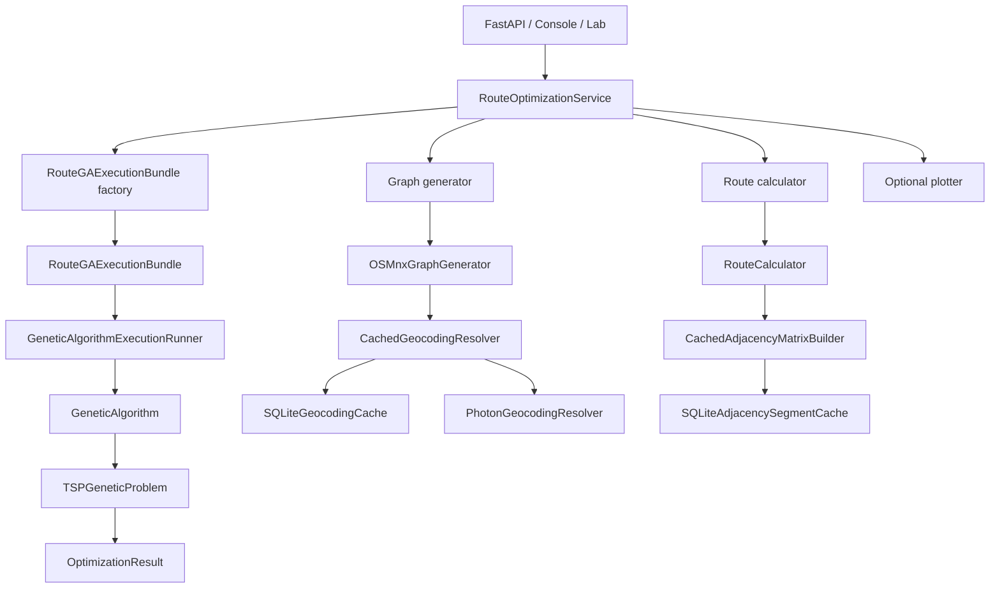

# Architecture Specification — API Best Route

## Overview

`API Best Route` is a layered route-optimization system built around a generic Genetic Algorithm core and a route-specific application layer. The codebase separates contracts, models, orchestration, and infrastructure implementations, with dependency injection handled at the API and console entry points.

## Architectural principles

### Layered separation

- **Domain** defines interfaces and models only.
- **Application** orchestrates the workflow.
- **Infrastructure** implements graph generation, route calculation, GA execution, plotting, and caching.
- **Entry points** wire dependencies and translate transport concerns.

### Dependency inversion

High-level services depend on contracts from `src/domain/interfaces`. Concrete implementations live in `src/infrastructure` and are assembled only in composition roots such as `api/dependencies.py` and `console/main.py`.

### Explicit contracts

Infrastructure classes explicitly inherit the domain interfaces they implement. This keeps the architecture readable during code review and prevents accidental structural conformance from becoming hidden coupling.

### Composition roots and factories

The API and console entry points act as composition roots. They assemble shared collaborators, create route execution bundles, and dispatch them through the generic runner.

### Problem-agnostic engine boundary

The genetic algorithm runtime is generic. Route semantics stay in the route problem adapter and route-domain models, not inside the core engine.

## High-level structure

```text
api_best_route/
├── api/
│   ├── dependencies.py
│   ├── main.py
│   └── schemas.py
├── changelog/
├── console/
│   └── main.py
├── lab/
│   └── README.md
├── src/
│   ├── application/
│   │   └── route_optimization_service.py
│   ├── domain/
│   │   ├── interfaces/
│   │   └── models/
│   └── infrastructure/
│       ├── caching/
│       ├── genetic_algorithm/
│       ├── genetic_algorithm_engine.py
│       ├── genetic_algorithm_execution_runner.py
│       ├── osmnx_graph_generator.py
│       ├── route_calculator.py
│       └── tsp_genetic_problem.py
└── tests/
```

## System composition



## Design patterns in use

| Pattern | Where it appears |
|---|---|
| Strategy | Selection, crossover, mutation, population generation, and heuristic distance resolution |
| Factory / abstract factory | Entry-point composition, adaptive GA family creation, and route execution bundle creation |
| Adapter | `TSPGeneticProblem` adapts route semantics to the generic GA contracts |
| Protocol-based contracts | Domain interfaces under `src/domain/interfaces` |
| Composition root | `api/dependencies.py` and `console/main.py` |

## Runtime responsibilities by layer

### Application

`RouteOptimizationService` orchestrates the workflow:

1. initialize the graph and route nodes;
2. create a route calculator;
3. optionally create a plotter;
4. build the route execution bundle;
5. execute the bundle through the generic runner;
6. convert projected coordinates back to lat/lon for the result.

### Domain

The domain layer defines:

- generic GA contracts such as `IGeneticProblem`, `IGeneticSolution`, and `IGeneticStateController`;
- generic GA runtime models such as `GenerationContext`, `GenerationRecord`, and `ConfiguredState`;
- route-domain models such as `RouteNode`, `RouteSegment`, `FleetRouteInfo`, and `OptimizationResult`.

### Infrastructure

The infrastructure layer provides:

- graph generation and coordinate conversion;
- route calculation and adjacency matrix construction;
- adaptive GA builders and operators;
- the generic GA engine and runner;
- caching implementations;
- plotting.

## Documentation map

- [`generic_ga.md`](generic_ga.md) documents the generic GA contracts, runtime models, and engine workflow.
- [`routes_optimization.md`](routes_optimization.md) documents the route-specific graph, route, and metric models.
- [`lab/README.md`](lab/README.md) documents the benchmark mode and its configuration contract.

## Technology notes

| Library | Role |
|---|---|
| `OSMnx` | Graph download, projection, and nearest-node resolution |
| `NetworkX` | Shortest-path computation and graph model |
| `geopy` | Photon geocoding resolver |
| `Shapely` | Spatial centroid and convex-hull operations |
| `PyProj` | Coordinate transformation |
| `NumPy` | Selection weights and heuristic helpers |
| `scikit-learn` | `KMeans` clustering for heuristic seeding |
| `FastAPI` | HTTP entry point |
| `Pydantic` | API schemas |
| `Matplotlib` | Optional plotter implementation |

## Responsibility summary

| Component | Layer | Responsibility |
|---|---|---|
| `src/domain/interfaces/*` | Domain | Contracts for the application and infrastructure |
| `src/domain/models/*` | Domain | Data structures and typed aggregates |
| `RouteOptimizationService` | Application | End-to-end workflow orchestration |
| `OSMnxGraphGenerator` | Infrastructure | Graph generation, geocoding, `graph_id`, coordinate conversion |
| `RouteCalculator` | Infrastructure | Segment computation and graph-aware metrics |
| `src/infrastructure/genetic_algorithm/*` | Infrastructure | GA operators, population generation, heuristic distance strategies, and state composition |
| `src/infrastructure/genetic_algorithm_engine.py` | Infrastructure | Generic GA execution loop |
| `src/infrastructure/genetic_algorithm_execution_runner.py` | Infrastructure | Generic execution seam for prepared collaborators |
| `src/infrastructure/caching/*` | Infrastructure | Persistent caching adapters and cache-aware builders |
| `api/*` | Entry point | HTTP transport and dependency composition |
| `console/main.py` | Entry point | Local execution and demonstration wiring |
