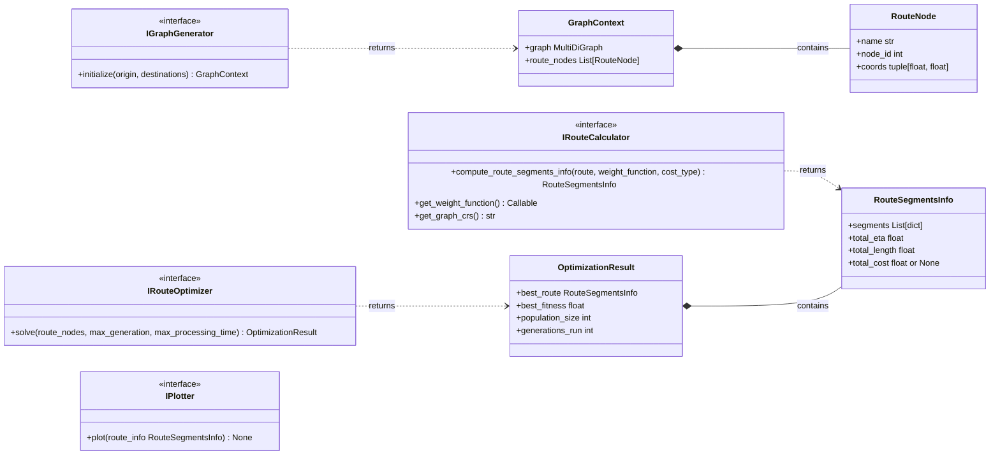
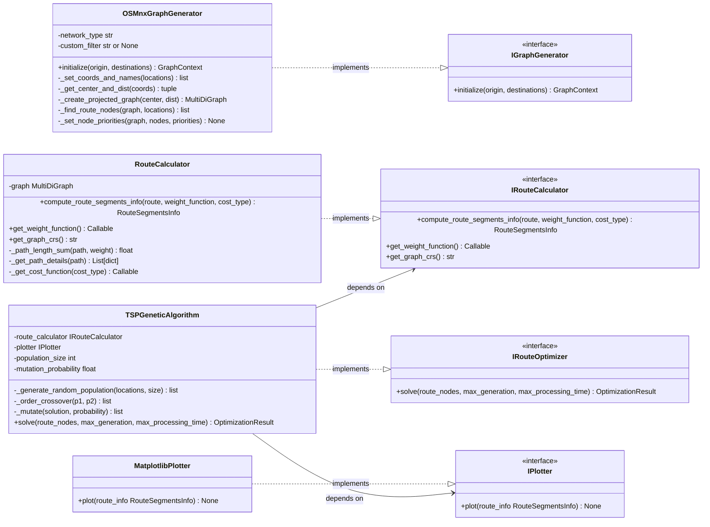
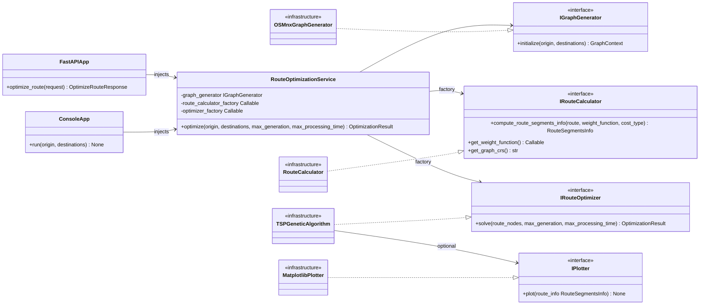

# Architecture Specification — API Best Route

## Table of Contents

1. [Overview](#1-overview)
2. [Architectural Principles](#2-architectural-principles)
3. [Proposed Directory Structure](#3-proposed-directory-structure)
4. [Layer Architecture](#4-layer-architecture)
5. [Class Diagrams](#5-class-diagrams)
6. [Interfaces](#6-interfaces)
7. [Domain Models](#7-domain-models)
8. [Concrete Implementations](#8-concrete-implementations)
9. [Application Service](#9-application-service)
10. [Entry Points and Dependency Injection](#10-entry-points-and-dependency-injection)
11. [Library Reference](#11-library-reference)

---

## 1. Overview

This document specifies the target architecture for the **API Best Route** system — a route optimization engine based on a Genetic Algorithm (TSP variant) using real street network data from OpenStreetMap.

---

## 2. Architectural Principles

### 2.1 SOLID

| Principle | Application in this system |
|---|---|
| **Single Responsibility** | Each class has one clearly defined job: `OSMnxGraphGenerator` builds graphs; `RouteCalculator` computes route metrics; `TSPGeneticAlgorithm` optimizes; `RouteOptimizationService` orchestrates. |
| **Open/Closed** | The system is open for extension (new `IPlotter`, new `IRouteOptimizer` implementations) without modifying existing classes. |
| **Liskov Substitution** | Any concrete class implementing an interface can replace another without altering program correctness. A mock `IGraphGenerator` can replace `OSMnxGraphGenerator` in tests. |
| **Interface Segregation** | Each interface exposes only the methods required by its consumers. `IPlotter` is a single-method interface. `IGraphGenerator` and `IRouteOptimizer` are narrow contracts. |
| **Dependency Inversion** | High-level modules (`RouteOptimizationService`, entry points) depend on abstractions (`IGraphGenerator`, `IRouteCalculator`, `IRouteOptimizer`, `IPlotter`), not on concrete classes. |

### 2.2 Dependency Injection

Dependencies that vary (graph generation strategy, optimization algorithm, visualization backend) are injected from outside at composition time. The `RouteOptimizationService` is constructed at the entry point (FastAPI `Depends`, console script, or test fixture) with concrete implementations wired in. No high-level class imports a concrete infrastructure class directly.

---

## 3. Proposed Directory Structure

```
api_best_route/
├── src/
│   ├── domain/
│   │   ├── __init__.py
│   │   ├── models.py              # RouteSegmentsInfo, OptimizationResult
│   │   └── interfaces.py          # IGraphGenerator, IRouteCalculator,
│   │                              # IRouteOptimizer, IPlotter
│   ├── application/
│   │   ├── __init__.py
│   │   └── route_optimization_service.py
│   └── infrastructure/
│       ├── __init__.py
│       ├── osmnx_graph_generator.py   # was: osmnx_graph_utils.py
│       ├── route_calculator.py        # was: route_calculator_utils.py
│       ├── tsp_genetic_algorithm.py   # genetic operators and algorithm (helpers incorporated)
│       └── pygame_plotter.py          # future implementation of IPlotter
├── api/
│   ├── __init__.py
│   ├── main.py                    # FastAPI application
│   ├── schemas.py                 # Pydantic request/response models
│   └── dependencies.py            # DI wiring via FastAPI Depends
└── console/
    └── main.py                    # future console entry point
```

---

## 4. Layer Architecture

```
+---------------------------------------------------------------+
|                        Entry Points                           |
|         FastAPI (api/main.py)   |   Console (console/main.py) |
+---------------------------------------------------------------+
                          |
                          v  (injects)
+---------------------------------------------------------------+
|                    Application Layer                          |
|              RouteOptimizationService                         |
+---------------------------------------------------------------+
        |                   |                   |
        v                   v                   v  (optional)
+----------------+  +----------------+  +----------------+
| IGraphGenerator|  |IRouteOptimizer |  |   IPlotter     |
+----------------+  +----------------+  +----------------+
        |                   |
        | (factory)         |  (factory)
        v                   v
+----------------+  +----------------+
|OSMnxGraph      |  |TSPGenetic      |    IRouteCalculator
|Generator       |  |Algorithm       |  <-- injected into optimizer
+----------------+  +----------------+
+---------------------------------------------------------------+
|                    Domain Layer                               |
|         RouteSegmentsInfo    /    OptimizationResult          |
+---------------------------------------------------------------+
```

Entry points are responsible solely for wiring concrete implementations and translating transport-level data (HTTP request/response, CLI arguments) to and from domain objects. No business logic lives in entry points.

---

## 5. Class Diagrams

### 5.1 Domain: Contracts

Interfaces and models only. Communicates what the system requires, independent of how it is built.



---

### 5.2 Infrastructure: Concrete Implementations

Each concrete class, its internal structure, and the contract it satisfies.



---

### 5.3 Composition: Service and Entry Points

How the service depends on interfaces and how each entry point wires the full dependency graph. Concrete classes appear as collapsed nodes to indicate which implementation is injected.



---

## 6. Interfaces

All interfaces are defined as Python `Protocol` classes (PEP 544, `typing.Protocol`) enabling structural subtyping. Concrete classes are not required to explicitly inherit from the Protocol; they only need to satisfy the structural contract. This keeps infrastructure classes free of framework coupling.

```python
# src/domain/interfaces.py

from typing import Protocol, Callable, Any, runtime_checkable
from .models import RouteSegmentsInfo, OptimizationResult, GraphContext


@runtime_checkable
class IGraphGenerator(Protocol):
    def initialize(
        self,
        origin: str | tuple[float, float],
        destinations: list[tuple[str | tuple[float, float], int]],
    ) -> GraphContext: ...


@runtime_checkable
class IRouteCalculator(Protocol):
    def compute_route_segments_info(
        self,
        route: list,
        weight_function: Any = ...,
        cost_type: str | None = ...,
    ) -> RouteSegmentsInfo: ...

    def get_weight_function(self) -> Callable: ...

    def get_graph_crs(self) -> str: ...


@runtime_checkable
class IRouteOptimizer(Protocol):
    def solve(
        self,
        route_nodes: list,
        max_generation: int = ...,
        max_processing_time: int = ...,
    ) -> OptimizationResult: ...


@runtime_checkable
class IPlotter(Protocol):
    def plot(self, route_info: RouteSegmentsInfo) -> None: ...
```

### Interface Responsibilities

| Interface | Consumer | Responsibility |
|---|---|---|
| `IGraphGenerator` | `RouteOptimizationService` | Initializes a projected street graph and resolves geographic locations to graph nodes |
| `IRouteCalculator` | `TSPGeneticAlgorithm`, `RouteOptimizationService` | Computes segment-level route metrics (ETA, length, cost) for an ordered list of nodes |
| `IRouteOptimizer` | `RouteOptimizationService` | Executes the optimization algorithm and returns the best route found |
| `IPlotter` | `RouteOptimizationService` | Renders route information visually; optional dependency |

---

## 7. Domain Models

Domain models are pure data containers with no external dependencies. They reside in `src/domain/models.py` and are shared across all layers.

```python
# src/domain/models.py

from dataclasses import dataclass, field
from typing import List
import networkx as nx


@dataclass
class RouteNode:
    """
    Represents a named, projected graph node resolved from a geographic location.
    """
    name: str
    node_id: int
    coords: tuple[float, float]


@dataclass
class GraphContext:
    """
    The output of IGraphGenerator.initialize().
    Bundles the projected street graph with the resolved route nodes,
    eliminating the raw tuple return from the graph initialization step.
    """
    graph: nx.MultiDiGraph
    route_nodes: list[RouteNode]


@dataclass
class RouteSegmentsInfo:
    """
    Stores computed metrics for an ordered sequence of route segments.
    Each segment maps to one destination in the optimized route.
    """
    segments: List[dict] = field(default_factory=list)
    total_eta: float = 0.0
    total_length: float = 0.0
    total_cost: float | None = None


@dataclass
class OptimizationResult:
    """
    The output of a single optimization run.
    Replaces the raw dict previously returned by TSPGeneticAlgorithm.solve().
    """
    best_route: RouteSegmentsInfo
    best_fitness: float
    population_size: int
    generations_run: int
```

---

## 8. Concrete Implementations

### 8.1 OSMnxGraphGenerator

**Location:** `src/infrastructure/osmnx_graph_generator.py`
**Implements:** `IGraphGenerator`

Encapsulates all OSMnx operations. Migrates the module-level functions from `osmnx_graph_utils.py` into a single cohesive class. Responsible for:

- Geocoding addresses and reverse-geocoding coordinates via OSMnx
- Computing a bounding area using Shapely (`MultiPoint.centroid`)
- Downloading and projecting a street network via OSMnx
- Snapping geographic points to the nearest graph node
- Annotating nodes with priority metadata

Configuration (network type, custom filter) is injected at construction time, allowing different instances for different road network scenarios without code changes.

### 8.2 RouteCalculator

**Location:** `src/infrastructure/route_calculator.py`
**Implements:** `IRouteCalculator`

Wraps a `networkx.MultiDiGraph` and computes route-level metrics using Dijkstra's algorithm. The graph is injected via the constructor — this class has no knowledge of how the graph was built, satisfying the Dependency Inversion Principle.

Because the graph is only available after `IGraphGenerator.initialize()` is called, this class is not injected as a singleton but rather instantiated on demand via a factory callable in `RouteOptimizationService`.

### 8.3 TSPGeneticAlgorithm

**Location:** `src/infrastructure/tsp_genetic_algorithm.py`
**Implements:** `IRouteOptimizer`

Receives an `IRouteCalculator` at construction time. The genetic operators (crossover, mutation, population generation) are implemented as private methods within the class. An optional `IPlotter` may also be injected to visualize progress after each generation.

The `solve()` method now returns an `OptimizationResult` dataclass instead of a raw dictionary, providing a typed contract to callers.

### 8.4 MatplotlibPlotter (future)

**Location:** `src/infrastructure/matplotlib_plotter.py`
**Implements:** `IPlotter`

Will implement the single-method `IPlotter` interface:

```python
def plot(self, route_info: RouteSegmentsInfo) -> None: ...
```

Because the interface is defined in the domain layer and the concrete implementation in the infrastructure layer, the application service has no dependency on Matplotlib. Any renderer (web-based, PNG file, interactive Folium map) can be swapped in by providing a different `IPlotter` implementation.

---

## 9. Application Service

**Location:** `src/application/route_optimization_service.py`

`RouteOptimizationService` is the single orchestrator. It depends exclusively on interfaces and on factory callables that produce interface-typed instances. It contains no business logic of its own beyond sequencing the steps of the optimization workflow.

```python
# src/application/route_optimization_service.py

from typing import Callable
from src.domain.interfaces import IGraphGenerator, IRouteCalculator, IRouteOptimizer, IPlotter
from src.domain.models import OptimizationResult


class RouteOptimizationService:
    def __init__(
        self,
        graph_generator: IGraphGenerator,
        route_calculator_factory: Callable[..., IRouteCalculator],
        optimizer_factory: Callable[[IRouteCalculator], IRouteOptimizer],
        plotter: IPlotter | None = None,
    ):
        self._graph_generator = graph_generator
        self._route_calculator_factory = route_calculator_factory
        self._optimizer_factory = optimizer_factory
        self._plotter = plotter

    def optimize(
        self,
        origin: str | tuple[float, float],
        destinations: list[tuple[str | tuple[float, float], int]],
        max_generation: int = 50,
        max_processing_time: int = 10000,
    ) -> OptimizationResult:
        context = self._graph_generator.initialize(origin, destinations)

        route_calculator = self._route_calculator_factory(context.graph)
        optimizer = self._optimizer_factory(route_calculator)

        result = optimizer.solve(
            route_nodes=context.route_nodes,
            max_generation=max_generation,
            max_processing_time=max_processing_time,
        )

        if self._plotter is not None:
            self._plotter.plot(result.best_route)

        return result
```

Note that `route_calculator_factory` and `optimizer_factory` are used per-call rather than per-service-instance. This is necessary because `RouteCalculator` depends on a graph that is only known at request time. The factories act as lightweight constructors bound to the DI container at startup.

---

## 10. Entry Points and Dependency Injection

### 10.1 FastAPI Entry Point

Dependency wiring is handled via FastAPI's `Depends` mechanism in `api/dependencies.py`. This file is the only place where concrete implementation classes are imported.

```python
# api/dependencies.py

from functools import lru_cache
from src.infrastructure.osmnx_graph_generator import OSMnxGraphGenerator
from src.infrastructure.route_calculator import RouteCalculator
from src.infrastructure.tsp_genetic_algorithm import TSPGeneticAlgorithm
from src.application.route_optimization_service import RouteOptimizationService


@lru_cache
def get_graph_generator() -> OSMnxGraphGenerator:
    return OSMnxGraphGenerator()


def get_route_optimization_service() -> RouteOptimizationService:
    return RouteOptimizationService(
        graph_generator=get_graph_generator(),
        route_calculator_factory=RouteCalculator,
        optimizer_factory=lambda calc: TSPGeneticAlgorithm(route_calculator=calc),
    )
```

```python
# api/main.py

from fastapi import FastAPI, Depends
from api.dependencies import get_route_optimization_service
from src.application.route_optimization_service import RouteOptimizationService

app = FastAPI()

@app.post("/optimize_route")
async def optimize_route(
    request: OptimizeRouteRequest,
    service: RouteOptimizationService = Depends(get_route_optimization_service),
):
    result = service.optimize(
        origin=request.origin,
        destinations=[(d.location, d.priority) for d in request.destinations],
        max_generation=request.max_generation,
        max_processing_time=request.max_processing_time,
    )
    # map result to response schema
    ...
```

### 10.2 Console Entry Point (future)

```python
# console/main.py

from src.infrastructure.osmnx_graph_generator import OSMnxGraphGenerator
from src.infrastructure.route_calculator import RouteCalculator
from src.infrastructure.tsp_genetic_algorithm import TSPGeneticAlgorithm
from src.infrastructure.matplotlib_plotter import MatplotlibPlotter
from src.application.route_optimization_service import RouteOptimizationService

service = RouteOptimizationService(
    graph_generator=OSMnxGraphGenerator(),
    route_calculator_factory=RouteCalculator,
    optimizer_factory=lambda calc: TSPGeneticAlgorithm(route_calculator=calc),
    plotter=MatplotlibPlotter(),
)

result = service.optimize(origin="...", destinations=[...])
```

The application service and all infrastructure classes are identical in both entry points. Only the wiring and data translation (HTTP vs. stdin/stdout) differ.

### 10.3 Test Entry Point

Dependency injection enables substitution of any component with a test double:

```python
# tests/test_route_optimization_service.py

class MockGraphGenerator:
    def initialize(self, origin, destinations):
        return mock_graph, mock_route_nodes

class MockOptimizer:
    def solve(self, route_nodes, max_generation, max_processing_time):
        return OptimizationResult(...)

service = RouteOptimizationService(
    graph_generator=MockGraphGenerator(),
    route_calculator_factory=lambda g: MockRouteCalculator(),
    optimizer_factory=lambda calc: MockOptimizer(),
)
```

No real network calls, no OSMnx, no genetic algorithm execution required by unit tests.

---

## 11. Library Reference

### 11.1 OSMnx

> "OSMnx is a Python package to download, model, analyze, and visualize street networks and other geospatial features from OpenStreetMap."
> — [Boeing, G. (2017). OSMnx: New Methods for Acquiring, Constructing, Analyzing, and Visualizing Complex Street Networks. Computers, Environment and Urban Systems.](https://osmnx.readthedocs.io)

**Role in this system:** Used exclusively inside `OSMnxGraphGenerator`. Responsible for geocoding addresses, downloading the street network graph from OpenStreetMap, projecting the graph to a metric CRS (via `ox.project_graph`), and snapping coordinates to the nearest graph node (`ox.distance.nearest_nodes`).

**Key APIs used:**
- `ox.graph_from_point` — constructs a `networkx.MultiDiGraph` from a geographic bounding box
- `ox.project_graph` — reprojects the graph from WGS84 to a local UTM CRS
- `ox.geocoder.geocode` — resolves an address string to `(lat, lon)`
- `ox.distance.nearest_nodes` — finds the nearest graph node to a projected coordinate
- `ox.settings.use_cache` — enables local disk caching of OSM API responses

### 11.2 NetworkX

> "NetworkX is a Python package for the creation, manipulation, and study of the structure, dynamics, and functions of complex networks."
> — [NetworkX Documentation](https://networkx.org/documentation/stable/)

**Role in this system:** Provides the `MultiDiGraph` data structure used throughout the system, and the shortest-path algorithm used by `RouteCalculator`. The graph built by OSMnx is a `networkx.MultiDiGraph` with street-level attributes (`length`, `maxspeed`, `geometry`, etc.) stored on edges.

**Key APIs used:**
- `nx.MultiDiGraph` — directed multigraph where nodes are intersections and edges are street segments
- `nx.single_source_dijkstra` — returns both the shortest-path cost and the node sequence; used in `RouteCalculator.compute_route_segments_info` with a custom weight function

### 11.3 PyProj

> "Cartographic projections and coordinate transformations library."
> — [PyProj Documentation](https://pyproj4.github.io/pyproj/stable/)

**Role in this system:** Used inside `OSMnxGraphGenerator` to convert geographic coordinates between reference systems. Since OSMnx stores node positions in the projected CRS of the graph (typically UTM), and all external inputs are in WGS84 (EPSG:4326), `pyproj.Transformer` is used bidirectionally.

**Key APIs used:**
- `Transformer.from_crs(source_crs, target_crs, always_xy=True)` — creates a reusable transformer object
- `Transformer.transform(x, y)` — applies the coordinate transformation

### 11.4 Shapely

> "Shapely is a BSD-licensed Python package for manipulation and analysis of planar geometric objects."
> — [Shapely Documentation](https://shapely.readthedocs.io/en/stable/)

**Role in this system:** Used inside `OSMnxGraphGenerator` to calculate the geographic centroid of a set of points (the center of the bounding area to pass to OSMnx) and to extract detailed path geometry from edges that carry a `LineString` geometry attribute.

**Key APIs used:**
- `MultiPoint(coords).centroid` — computes the centroid of a collection of geographic points
- `LineString.coords` — iterates over the coordinate sequence of a curved road segment

### 11.5 FastAPI

> "FastAPI is a modern, fast (high-performance), web framework for building APIs with Python based on standard Python type hints."
> — [FastAPI Documentation](https://fastapi.tiangolo.com)

**Role in this system:** Serves as one delivery mechanism (entry point) for the application. The API layer is a thin adapter: it translates HTTP request/response payloads to and from domain objects and delegates all logic to `RouteOptimizationService`. FastAPI's `Depends` system is used to wire the dependency graph at startup.

### 11.6 Pydantic

> "Data validation using Python type annotations."
> — [Pydantic Documentation](https://docs.pydantic.dev/latest/)

**Role in this system:** Defines HTTP-level request and response schemas in `api/schemas.py`. Pydantic models are strictly confined to the API layer and are never passed into the application or infrastructure layers. Domain models (`RouteSegmentsInfo`, `OptimizationResult`) are plain Python dataclasses.

### 11.7 NumPy

> "The fundamental package for scientific computing with Python."
> — [NumPy Documentation](https://numpy.org/doc/stable/)

**Role in this system:** Used inside `TSPGeneticAlgorithm` to compute selection probabilities for the roulette-wheel parent selection mechanism (`1 / np.array(fitness_values)`). NumPy's vectorized operations replace an explicit Python loop for this weighted random selection step.

### 11.8 Matplotlib

> "Matplotlib is a comprehensive library for creating static, animated, and interactive visualizations in Python."
> — [Matplotlib Documentation](https://matplotlib.org/stable/)

**Role in this system:** Will be used by the future `MatplotlibPlotter` implementation of `IPlotter`. Since `IPlotter` is defined in the domain layer and `MatplotlibPlotter` in the infrastructure layer, Matplotlib is an optional runtime dependency; the system functions completely without it when no plotter is injected.

---

## Summary of Responsibilities

| Class / Module | Layer | Responsibility |
|---|---|---|
| `interfaces.py` | Domain | Defines contracts (`IGraphGenerator`, `IRouteCalculator`, `IRouteOptimizer`, `IPlotter`) |
| `models.py` | Domain | `RouteNode`, `GraphContext`, `RouteSegmentsInfo`, `OptimizationResult` — pure data |
| `route_optimization_service.py` | Application | Orchestrates the full optimization workflow |
| `osmnx_graph_generator.py` | Infrastructure | Graph construction and geocoding via OSMnx |
| `route_calculator.py` | Infrastructure | Segment-level metric computation (ETA, length, cost) |
| `tsp_genetic_algorithm.py` | Infrastructure | Genetic Algorithm optimization loop with internal operators and optional plotter |
| `matplotlib_plotter.py` | Infrastructure | Future: visualization of `RouteSegmentsInfo` |
| `api/main.py` | Entry Point | HTTP request handling via FastAPI |
| `api/schemas.py` | Entry Point | Pydantic HTTP schemas |
| `api/dependencies.py` | Entry Point | Dependency wiring for FastAPI |
| `console/main.py` | Entry Point | Future: CLI wiring and execution |
